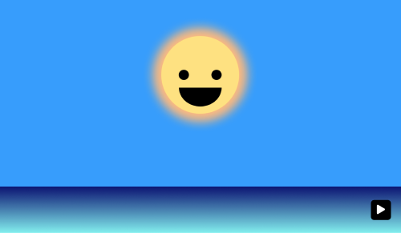
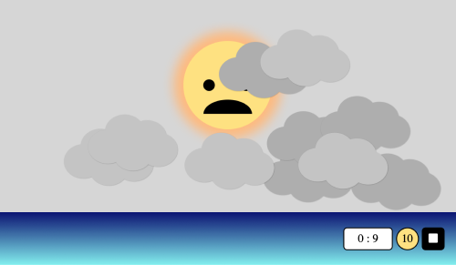
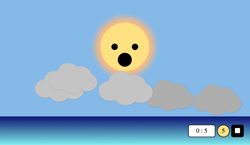
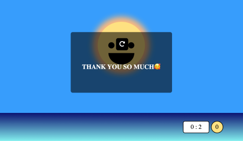
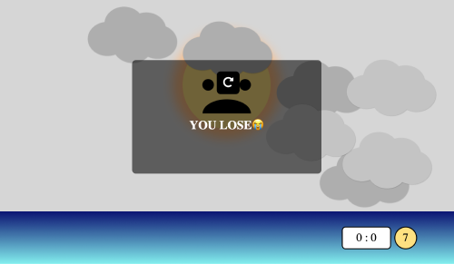
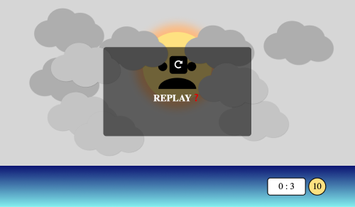

# MINIGAME - 먹구름을 쫓아내자

 

## 게임소개

---

구름에 가려져 슬픈 해를 위해 구름을 없애주는 게임입니다.

게임은 총 3단계로 제한 시간은 1단계 10초 2단계 20초 3단계 30초!

물론, 단계가 높아질수록 먹구름도 늘어납니다!

해를 위해 구름을 없애주세요!

 
 

## 게임방법

---

 

- ### 준비 화면

게임 준비 화면입니다. 우측 하단에 보이는 재생 버튼을 누르면 배경음악과 함께 게임이 시작됩니다.

 

- ### 플레이 화면

시작 버튼을 누름과 동시에 우측 하단에 타이머와 현재 남아있는 구름의 수가 뜨고 타이머가 시작됩니다.

구름을 클릭하면 구름들이 사라지고 남아있는 구름의 수가 업데이트됩니다.

 

남아있는 구름의 수가 처음 수의 절반이 되면 해의 표정이 바뀝니다.

 

- ### 종료 화면

**WIN!!**

제한 시간 안에 구름을 모두 없앴다면 웃는 해와 함께 승리 팝업이 화면에 나타납니다.

 

**LOSE...**

제한 시간 안에 구름을 없애지 못했다면 패배 팝업이 화면에 나타납니다.

 

**REPLAY?**

플레이 중간에 스탑 버튼을 누르면 취소 팝업이 화면에 나타납니다.

 

++ 추가로 모든 팝업에 나타나는 리프레시 버튼을 누르면 게임이 처음부터 다시 시작됩니다.

 

---

- 사용 언어 및 툴 : HTML, CSS, JavaScript, Figma

- 해, 구름 및 배경화면 : 자체제작

- 아이디어 및 일부 사운드 소스 제공 : 드림코딩 by 엘리🥰
